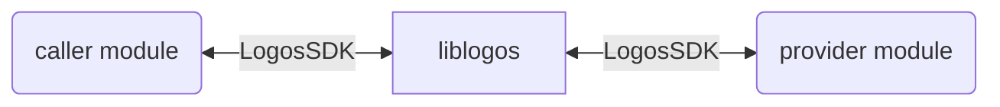

# logos-playground

Misc logos things, hopefully helpful.

## Table of Contents

- [Logos Basecamp](#logos-basecamp)
- [First build](#first-build)
- [Finding modules and corresponding repo urls](#finding-modules-and-corresponding-repo-urls)
- [The core between modules](#the-core-between-modules)
  - [Logos SDKs](#logos-sdks)

## Logos Basecamp

https://press.logos.co/article/logos-basecamp

Basecamp version [0.1.2](https://github.com/logos-co/logos-basecamp/releases?q=0.1.2) is on it's way! Try the latest Release Candidate.

## First build

Get the tools, build your first local app on Logos.
[Zero to Logos App](Zero-to-Logos-App.md)

## Finding modules and corresponding repo urls

As we approach version 0.1.2 (currently on RC3), the module lists can be inspected in two ways:

- "latest" or a release tag - showing all modules for master or that release
- pre-release - showing the modules that were ready when the pre-release was made (likely not all modules)

NOTE: this will become simpler when version 0.1.2 is released.

Most URLs have been consolidated into [logos-co](https://github.com/logos-co), previously across [Messaging](https://github.com/logos-messaging/), [Storage](https://github.com/logos-storage/), and [Blockchain](https://github.com/logos-blockchain)

Note: there is a wallet ui and wallet module in both logos-co, and logos-blockchain.

### Full names and description most urls

See/run `./scripts/list-modules.sh` in this repo (lists latest by default)
Can list pre-releases eg `RELEASE_TAG="build-20260514-faaa8d1-97" ./scripts/list-modules.sh`

### Full descriptions (truncated names, no urls)

From Basecamp Package Manager, (icons on the left, upper-most cube).
Choose release tag from menu in top-right of package manager.

### Full names (truncated descriptions, no urls)

Use the package downloader tool:

```
# Build lgpd
nix build 'github:logos-co/logos-package-downloader#cli' --out-link ./downloader

# List latest available packages
./downloader/bin/lgpd list

# List packages from release
./downloader/bin/lgpd releases
./downloader/bin/lgpd list --release build-20260514-faaa8d1-97
```

(Ref: [Logos Developer Guide](https://github.com/logos-co/logos-tutorial/blob/master/logos-developer-guide.md#53-downloading-and-installing-from-a-registry))

## The core between modules

The Logos core library (liblogos) handles the loading/unloading of modules, as well as invoking methods and passing events between modules.



See [Architecture](https://github.com/logos-co/logos-tutorial/blob/master/logos-developer-guide.md#architecture) in the developer guide for more details.

### Logos SDKs

A developer can use the following Logos language sdks to readily interact with modules:

- [C++](https://github.com/logos-co/logos-cpp-sdk)
- [Nim](https://github.com/logos-co/logos-nim-sdk)
- [JavaScript](https://github.com/logos-co/logos-js-sdk)
- [Rust](https://github.com/logos-co/logos-rust-sdk)
  - [Example](https://github.com/logos-co/logos-rust-example-module) contains two modules (provider & caller), the `caller` using the sdk to interact with the `provider`

List [here](https://github.com/logos-co/?q=logos-+-sdk&type=all&language=&sort=) SDK repos (and some extra from the non-regex filter).
